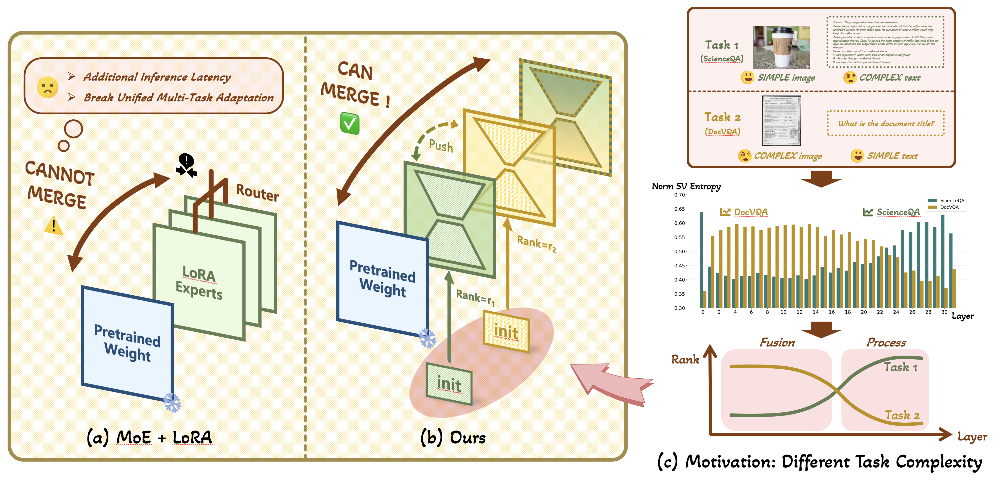

<h1 align="center">ThanoRA: Task Heterogeneity-Aware Multi-Task Low-Rank Adaptation</h1>

<h2> Abstract </h2>

Low-Rank Adaptation (LoRA) is widely adopted for downstream fine-tuning of foundation models due to its efficiency and zero additional inference cost. Many real-world applications require foundation models to specialize in multiple tasks simultaneously, motivating the need for efficient multi-task adaptation. While recent approaches integrate LoRA with mixture-of-experts (MoE) to address this, the use of routers prevents parameter mergeability, which increases inference overhead and hinders unified multi-task adaptation, thereby limiting deployment practicality. In this work, we propose \textbf{ThanoRA}, a Task Heterogeneity-Aware Multi-Task Low-Rank Adaptation framework that enables multi-task adaptation while preserving the inference efficiency of LoRA. ThanoRA jointly models task heterogeneity and mitigates subspace interference throughout training. Specifically, motivated by inherent differences in complexity and heterogeneity across tasks, ThanoRA constructs task-specific LoRA subspaces at initialization, enabling fine-grained knowledge injection aligned with task heterogeneity. Furthermore, to prevent task interference and subspace collapse during multi-task training, ThanoRA introduces a subspace-preserving regularization that maintains the independence of task-specific representations. With the synergy of both components, ThanoRA enables efficient and unified multi-task adaptation. Extensive experiments across multimodal and text-only benchmarks under varying multi-task mixtures demonstrate that ThanoRA consistently achieves robust and superior performance over strong baselines without introducing additional inference overhead.
